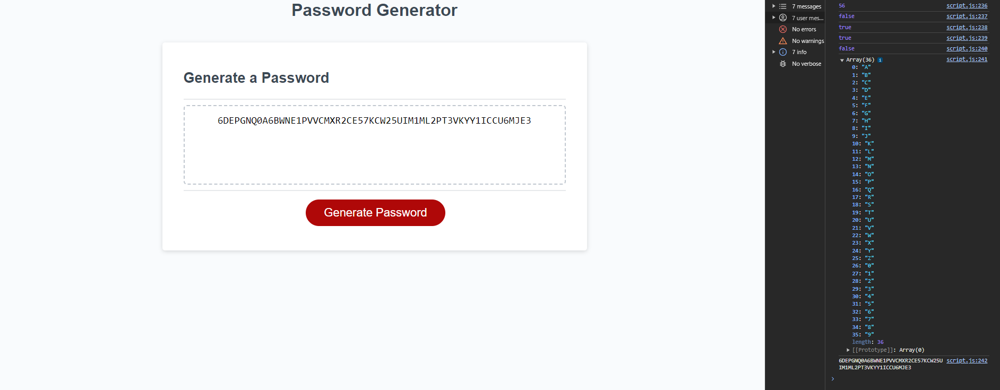

# Ben-Sadler-Password-Generator

## Description 

This challenge requires creating an application that an employee can use to generate a random password based on criteria they’ve selected by modifying starter code. This app will run in the browser, and will feature dynamically updated HTML and CSS powered by JavaScript code that you write. It will have a clean and polished user interface that is responsive, ensuring that it adapts to multiple screen sizes.

<ins>The Acceptance Criteria </ins>  

* Generate a password when the button is clicked
  * Present a series of prompts for password criteria
    * Length of password
      * At least 8 characters but no more than 128.
    * Character types
      * Lowercase
      * Uppercase
      * Numeric
      * Special characters ($@%&*, etc)
  * Code should validate for each input and at least one character type should be selected
  * Once prompts are answered then the password should be generated and displayed in an alert or written to the page

<strong>Links</strong>

Website: https://bena251.github.io/Ben-Sadler-Password-Generator/  
Website Repository: https://github.com/BenA251/Ben-Sadler-Password-Generator

## Usage 

<strong>Console Screenshot:</strong>  

## Credits

Challenge/Project Material was provided by course. 

## License

MIT license

© 2023 edX Boot Camps LLC. Confidential and Proprietary. All Rights Reserved.
